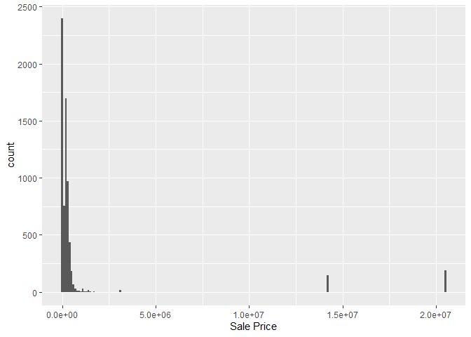
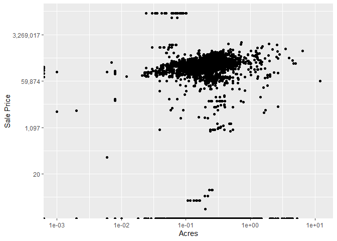
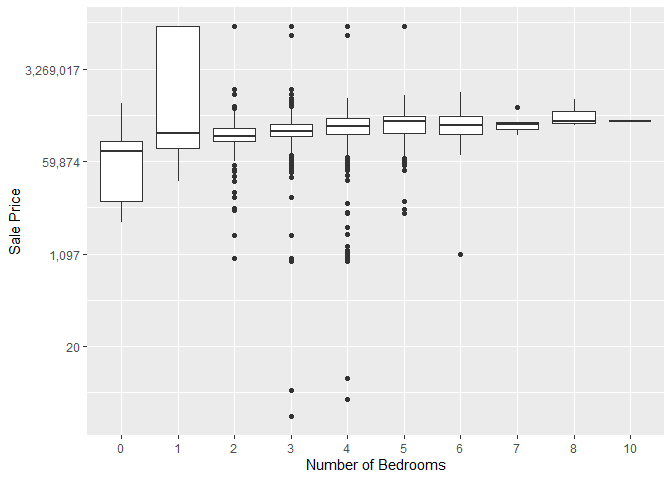
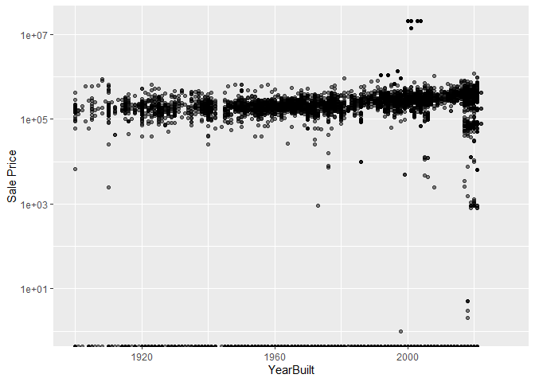
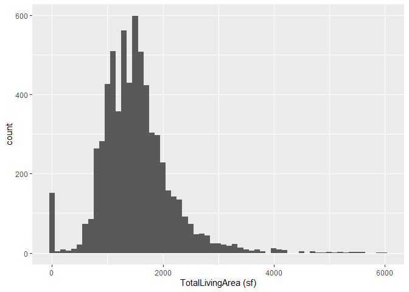
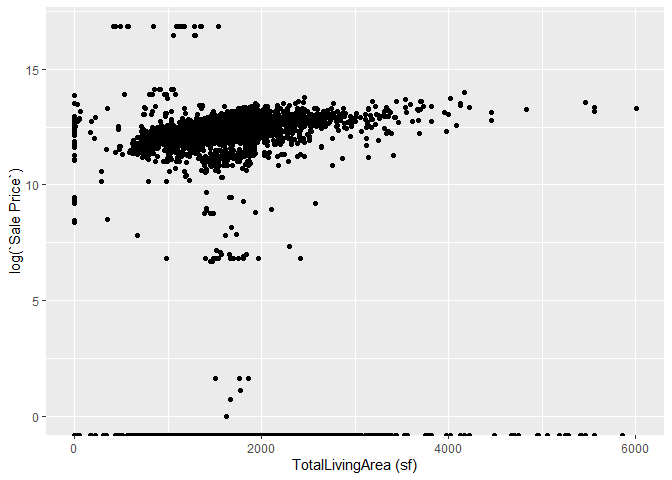

<!-- README.md is generated from README.Rmd. Please edit the README.Rmd file -->

# Lab report #1

Follow the instructions posted at <https://ds202-at-isu.github.io/labs.html> for the lab assignment. The work is meant to be finished during the lab time, but you have time until Monday evening to polish things.

Include your answers in this document (Rmd file). Make sure that it knits properly (into the md file). Upload both the Rmd and the md file to your repository.

All submissions to the github repo will be automatically uploaded for grading once the due date is passed. Submit a link to your repository on Canvas (only one submission per team) to signal to the instructors that you are done with your submission.

#### import data

``` r
library(classdata)
library(ggplot2)
library(dplyr)
```

```         
## 
## Attaching package: 'dplyr'

## The following objects are masked from 'package:stats':
## 
##     filter, lag

## The following objects are masked from 'package:base':
## 
##     intersect, setdiff, setequal, union
```

## 1. inspect the first few lines of the data set:

``` r
?ames
names(ames)
```

```         
##  [1] "Parcel ID"             "Address"               "Style"                
##  [4] "Occupancy"             "Sale Date"             "Sale Price"           
##  [7] "Multi Sale"            "YearBuilt"             "Acres"                
## [10] "TotalLivingArea (sf)"  "Bedrooms"              "FinishedBsmtArea (sf)"
## [13] "LotArea(sf)"           "AC"                    "FirePlace"            
## [16] "Neighborhood"
```

``` r
dfAmes <- classdata::ames
head(dfAmes)
```

```         
## # A tibble: 6 × 16
##   `Parcel ID` Address      Style Occupancy `Sale Date` `Sale Price` `Multi Sale`
##   <chr>       <chr>        <fct> <fct>     <date>             <dbl> <chr>       
## 1 0903202160  1024 RIDGEW… 1 1/… Single-F… 2022-08-12        181900 <NA>        
## 2 0907428215  4503 TWAIN … 1 St… Condomin… 2022-08-04        127100 <NA>        
## 3 0909428070  2030 MCCART… 1 St… Single-F… 2022-08-15             0 <NA>        
## 4 0923203160  3404 EMERAL… 1 St… Townhouse 2022-08-09        245000 <NA>        
## 5 0520440010  4507 EVERES… <NA>  <NA>      2022-08-03        449664 <NA>        
## 6 0907275030  4512 HEMING… 2 St… Single-F… 2022-08-16        368000 <NA>        
## # ℹ 9 more variables: YearBuilt <dbl>, Acres <dbl>,
## #   `TotalLivingArea (sf)` <dbl>, Bedrooms <dbl>,
## #   `FinishedBsmtArea (sf)` <dbl>, `LotArea(sf)` <dbl>, AC <chr>,
## #   FirePlace <chr>, Neighborhood <fct>
```

-   There are 16 variables. These include Parcel ID, Address, Style, Occupancy, Sale Date, Sale Price, Multi Sale, YearBuilt, Acres, TotalLivingArea(sf), Bedrooms, FinishedBsmtArea(sf), LotArea(sf), AC, FirePlace, and Neighborhood. You can find data on the meaning and range of the variables by running the code.

## 2. is there a variable of special interest or focus?

-   Since the main varible for exploration is Sales Price, we want to look at variables that would likely influence the price. Of the 16, we think Acres, YearBuilt, TotalLivingArea, and Bedrooms would be variables worth looking at that would likely effect the Sales Price.

## 3. start the exploration with the main variable:

``` r
ggplot(ames, aes(x = `Sale Price`)) + geom_histogram(binwidth = 100000)
```

<!-- -->

-   The range of the variable Sale Price is between 0 and 20,500,000. A vast majority of the housing price falls between 0 and 200,000. There’s a fair amount of outliers roughly in the million to 2 million range for housing price.

## 4. pick a variable that might be related to the main variable.

#### Deo Shaji

``` r
DeoShajiPlot <- ggplot(ames, 
                       aes(x = Acres, y = `Sale Price`)) +
 scale_y_continuous(trans = "log", labels = scales::comma) +
  scale_x_log10() +
  geom_jitter()
  
DeoShajiPlot
```

```         
## Warning in scale_y_continuous(trans = "log", labels = scales::comma):
## log-2.718282 transformation introduced infinite values.

## Warning in scale_x_log10(): log-10 transformation introduced infinite values.

## Warning: Removed 89 rows containing missing values or values outside the scale range
## (`geom_point()`).
```

<!-- -->

-   The overall pattern is that the the datat has a slight positive correlation. As the square feet of acres increases, sale price also increases. Most of the data is clustered with some outliers with high prices or low prices.

#### Megan Mason

``` r
new_df <- dfAmes %>% filter(!is.na(Bedrooms)) %>% filter(`Sale Price` != 0) %>% select("Bedrooms", "Sale Price")

head(new_df)
```

```         
## # A tibble: 6 × 2
##   Bedrooms `Sale Price`
##      <dbl>        <dbl>
## 1        2       181900
## 2        1       127100
## 3        4       245000
## 4        4       368000
## 5        1       110000
## 6        3       350000
```

``` r
ggplot(new_df, aes(x=factor(Bedrooms), y=(`Sale Price`))) +
  geom_boxplot() +
  scale_y_continuous(trans = "log", labels = scales::comma) +
  labs(x="Number of Bedrooms", y="Sale Price")
```

<!-- -->

``` r
summary_df <- new_df %>%
    group_by(Bedrooms) %>%
    summarise(Mean_SalePrice = mean(`Sale Price`, na.rm = TRUE))

print(summary_df)
```

```         
## # A tibble: 10 × 2
##    Bedrooms Mean_SalePrice
##       <dbl>          <dbl>
##  1        0        128760.
##  2        1       7036000.
##  3        2       1391944.
##  4        3       1220705.
##  5        4       1852601.
##  6        5        909019.
##  7        6        325206.
##  8        7        327367.
##  9        8        464150 
## 10       10        343000
```

-   (Megan’s Code) We conclude from the boxplots that the mean sale price is low at no bedrooms, is high at one bedroom, houses with 2-5 bedrooms have similar means lower than one bedroom, and houses with 6-10 bedrooms have similar means that are lower than 2-5 bedrooms. The distributions are similar and with the exception of outliers, they have a similar shape. However, for houses with one or no bedrooms, the distribution is much wider, with many of the houses with only one bedroom having high sale prices, but houses with no bedrooms have low sale prices. Neither of these groups have any outliers.

###Sam Bonner

``` r
ggplot(ames, aes(x=YearBuilt, y=`Sale Price`)) +
  geom_point(alpha = 0.5) +
  xlim(1900,2030) +
  scale_y_log10()
```

```         
## Warning in scale_y_log10(): log-10 transformation introduced infinite values.

## Warning: Removed 497 rows containing missing values or values outside the scale range
## (`geom_point()`).
```

<!-- -->

-   The plot has a slight positive trend, but overall prices seem to be steady based on year built. There are multiple outliers, and the positive trend line is very gradual, indicating that year built is likely not the best variable to predict sale price.

#### Jacob Bartlett

``` r
ggplot(data = subset(ames, !is.na(`TotalLivingArea (sf)`)), aes(x = `TotalLivingArea (sf)`)) + geom_histogram(binwidth = 100)
```

<!-- -->

-   The variable I’ll be examing is the TotalLivingArea. The range of this variable is between 0 and 6,007 square feet. The histogram shows that a majority of the houses have a ling area between 1,000 and 2,000 square feet. The graph is unimodal and skewed right, and there are some outliers that are past 4,500 square feet.

``` r
ggplot(data = subset(ames, !is.na(`TotalLivingArea (sf)`)), aes(x = `TotalLivingArea (sf)`, y = log(`Sale Price`))) + geom_point()
```

<!-- -->

-   The scatterplot shows that the two variables have a slightly positive and linear relationship. This variable doesn’t do a good job of describing the outliers in question 3. There are some oddities with this graph since there are 447 rows that are NA in the variable TotalLivingArea. This causes the values in the same rows in Sale Price to fall to the bottom of the graph which doesn’t help give a full visualization of the two variables.
